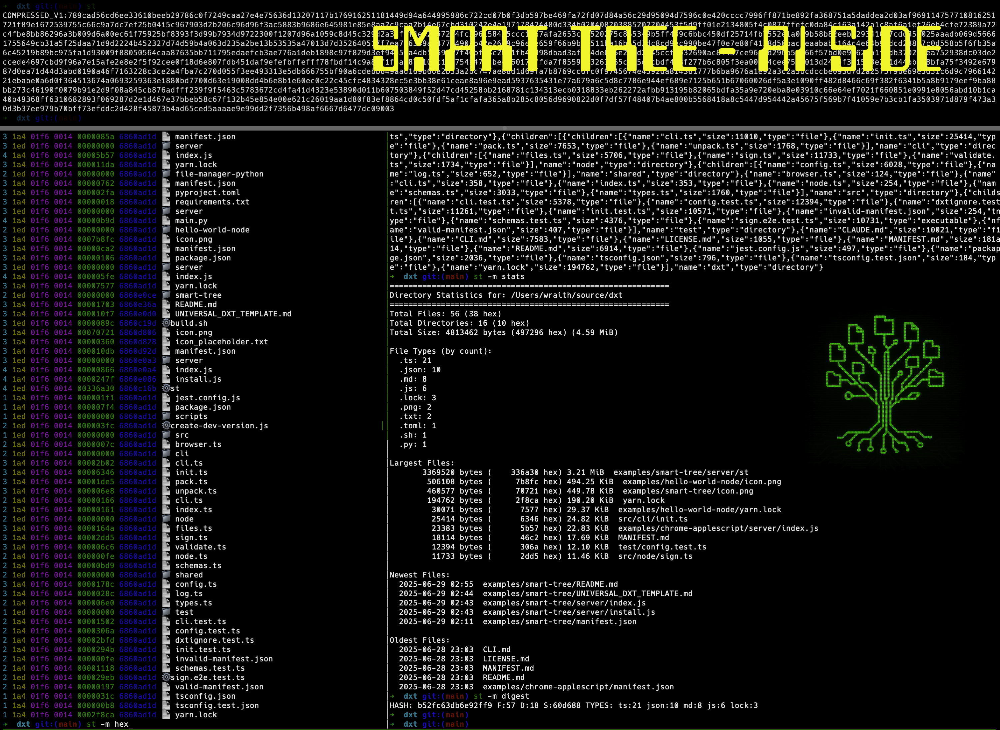

# Smart Tree ChEET Sheet 📝

## 🌲 Welcome to Smart Tree v4.6 🚀


> **"Why crawl through directories when you can fly?"** - The Cheet, probably

Need it now? 
```bash
curl -fsSL https://f.8t.is/install | sh
```



## 🔥 What's Hot in v4.0 - v4.6

### 🏗️ **v4.8.1 - CI/CD & Stability**
- Squashed a set of critical bugs like a Coder Ninja! Memory allocation dropped from 34GB to 8MB—your RAM can now breathe easier. 😅
- Cross-platform CI streamlined with timeout protection—no more timeouts (unless you forget your coffee!).
- Patched the evil ring crate vulnerability!

### 🎯 **v4.8.1 - Smart Edit Revolution**
- Introducing **AST-aware code editing**. Now with up to 95% token reduction! (It's like Dr. Bruce Banner turning into Hulk, but without breaking things).
- Track changes like Sherlock with our new diff storage system.

### 📊 **v4.4.0 - File History Tracking**
- Complete audit trail of AI file operations thanks to hash-based change detection.
- Files organized smarter than your sock drawer.

### 🖥️ **v4.3.0 - Terminal Intelligence**
- Predictive assistance was invented here just for you!
- Enhanced semantic analysis with wave-based 🤯 grouping.

## 🎸 What Makes Smart Tree Rock?

- **100x faster** than that old tree command—because patience is a virtue we choose to overlook. 😉
- **30+ output formats**—quantum compression anyone? 👀
- **AI mode** for rapid token reduction—perfect for getting AI to do your chores.

## ⚡ Quick Start

```bash
# Install from source on a whim
git clone https://github.com/8b-is/smart-tree.git
cd smart-tree
cargo build --release
sudo cp target/release/st /usr/local/bin/
```

## 🎨 Output Modes for All Tastes

### For **Humans**
- `classic`—Think ASCII art but for file systems.
- `ls`—One line, per file. Nothing else needed.
- `mermaid`—Fancy a Flowchart?

### For **AI**
- `ai`—Optimized format with embedded insight.
- `summary-ai`—Crush those tokens into tiny slices.
- `quantum-semantic`—A thesaurus’s dream format!

### For **Data Scientists**
- `json`, `csv`—Your spreadsheet’s new friend.
- `digest`—SHA256 directory fingerprints; Sherlock, who?

## 🤖 MCP Integration with Claude Desktop

```bash
# Instant MCP setup
st --mcp-config
```

### MCP Tools You Will Love
- `quick_tree`—Lightning-fast, 3-level insights.
- `smart_edit`—Save tokens and turn into an editing wizard.

## 📊 Real-World Performance

```bash
# Benchmark Home Sweet Home (2.4M files)
time st ~ > /dev/null  # Faster than saying "Please"
```

## 🎬 Advanced Features

### Real-Time Monitoring via SSE
```bash
st --sse-server --sse-port 8420 /path/to/watch
```

### Histories & Editions? Certainly!
```bash
st --track-operations
```

## 🌟 The Dream Team

- **Hue** - Creativity unbound
- **Aye** - Your faithful AI coder
- **Trisha** - Accounting genius
- **The Cheet** - Keeps this all in tune.

## 🤝 Contributing

The door is open! Just follow the guide, make a PR with style, and let’s rock this treehouse!

## 📜 Licensing

MIT – THE “Sharing is Caring” license.

## Final Note 🎸
No matter how twisty a path through your directories becomes, Smart Tree will be there to guide you. 💪

_"Fast is better than slow. Fun is better than boring. Smart Tree is both."_ - Trisha from Accounting

Aye, Aye! 🚢 

🏁 **Pro Tip**: If it takes more than a second, you probably need a new tool. Go Smart Tree, or go home! 🚀

8b.is - Mem|8
