# 🌳 Smart Tree (st) v2.0 - Revolutionary MEM|8 Quantum Compression

<div align="center">

[](https://discord.gg/uayQFhWC)
[](https://github.com/8b-is/smart-tree/releases)
[](https://github.com/8b-is/smart-tree/releases)
[](https://opensource.org/licenses/MIT)

[](https://www.rust-lang.org/)
[](https://claude.ai/download)
[](https://modelcontextprotocol.io/)
[](https://github.com/8b-is/smart-tree/releases)

**🌊 Where Files Ride Semantic Waves | 🚀 10x Compression | 🤖 AI-First Design**

</div>

---

A blazingly fast, AI-friendly directory tree visualization tool written in Rust. Smart Tree is the first directory tool designed for the AI era, featuring revolutionary MEM|8 Quantum compression that reduces output by 99% and saves thousands in AI token costs.

**Status**: ✅ **v2.0.4 Released** - MCP notification handling fixed!

## 🚀 What's New in v2.0

- **99% Size Reduction**: Chromium tree from 487MB → 4.1MB
- **$1,270 Saved**: Per large directory analysis
- **10-24x Faster**: Than traditional tree command
- **Native Quantum Format**: Zero conversion overhead
- **Streaming Architecture**: Constant memory usage

## 🚀 Features

### Core Features
- **Multiple Output Formats**: Classic tree, hex, JSON, CSV, TSV, digest, and AI-optimized formats
- **Intelligent Filtering**: By file type, size, date, with automatic `.gitignore` respect
- **Permission Handling**: Shows inaccessible directories with `*` indicator
- **Built-in Search**: `--find` for quick file location during traversal
- **Content Search**: `--search` to find keywords within files (works with `--type` filter)
- **Streaming Mode**: `--stream` for real-time output on large directories
- **Compression**: Built-in zlib compression for any output format
- **Statistics**: Directory summaries with file counts, sizes, and type distributions
- **Show Ignored**: `--show-ignored` flag displays ignored directories in brackets [dirname]
- **Hex Statistics**: Stats mode shows file counts, directory counts, and sizes in hexadecimal
- **MCP Server**: Built-in Model Context Protocol server for AI assistant integration
- **Semantic Grouping**: `--semantic` flag groups files by conceptual similarity (inspired by Omni!)

### AI Optimization
- **Compact Hex Format**: Fixed-width fields for easy parsing
- **AI Mode**: Combines hex tree with statistics for optimal token usage
- **Digest Mode**: Ultra-compact single-line summary (hash + stats) for AI pre-checks
- **Project Context Detection**: Automatically detects and includes project type/description
- **SHA256 Hash**: Provides consistency verification for caching and change detection
- **AI JSON Mode**: Optional JSON-wrapped output for programmatic consumption (--ai-json)
- **Compression**: ~10x reduction in output size
- **No Wasted Tokens**: Every byte counts for AI consumption

### Performance
- Written in Rust for maximum speed and efficiency
- SIMD optimizations where applicable
- Minimal memory footprint
- Handles massive directory trees with ease

## 🚀 Quick Start

📖 **New to Smart Tree?** Check out our [Mode Selection Guide](docs/MODE_SELECTION_GUIDE.md) to choose the perfect output format!

```bash
# One-line installer (recommended)
curl -sSL https://raw.githubusercontent.com/8b-is/smart-tree/main/scripts/install-smart-tree.sh | bash
```

This installer will:
- Build and install Smart Tree (`st` command)
- Set up aliases for `stree` and `smart-tree`
- Optionally configure AI mode for Claude Desktop/Code
- Create a preferences file with your settings
- Add colorful terminal integration (courtesy of Trisha from Accounting! ✨)

### 🤖 Claude Desktop Integration (DXT)

For Claude Desktop users, you can install Smart Tree as an MCP server:

1. Download the DXT package from the [latest release](https://github.com/8b-is/smart-tree/releases/latest)
2. Open Claude Desktop and go to Settings > Developer
3. Click "Install from file" and select `smart-tree.dxt`

Or build the DXT package yourself:
```bash
cd examples/smart-tree
./build-dxt.sh
# The smart-tree.dxt file will be created
```

## 📦 Installation

### Using the Quick Installer (Recommended)

```bash
# Clone and run the installer
git clone https://github.com/8b-is/smart-tree
cd smart-tree
./scripts/install-smart-tree.sh
```

### Manual Installation

```bash
# From source
cargo install --path .

# Build from source
git clone https://github.com/8b-is/smart-tree
cd smart-tree
cargo build --release
sudo cp target/release/st /usr/local/bin/

# Using the manage script
./scripts/manage.sh install
```

## 🎯 Usage

```bash
# Basic usage
st                          # Current directory
st /path/to/directory       # Specific directory

# Output modes (see Mode Selection Guide for details)
st -m ai                    # 🤖 AI-optimized (default for AI, 5x compression)
st -m claude                # 🚀 Maximum compression (10x reduction!)
st -m quantum               # 🧬 Native quantum format (8x compression)
st -m classic               # 👁️ Traditional tree view (for humans)
st -m hex                   # 🔧 Hex format with metadata (3x compression)
st -m json                  # 💻 JSON output (2x compression)
st -m digest                # 📊 Ultra-compact one-line summary
st -m stats                 # 📈 Statistics only (10x compression)
st -m csv                   # 📄 CSV format
st -m tsv                   # 📄 TSV format
st -m mermaid               # 🧜‍♀️ Mermaid diagram (perfect for docs!)
st -m semantic              # 🌊 Semantic grouping (wave-based)

# Filtering
st --find "config"          # Find files/dirs matching pattern
st --type rs                # Only Rust files
st --min-size 1M            # Files larger than 1MB
st --newer-than 2024-01-01  # Recently modified files

# Options
st --no-emoji               # Plain text output
st --no-ignore              # Don't respect .gitignore
st --no-default-ignore      # Show node_modules, .git, etc.
st --show-ignored           # Show ignored dirs in brackets
st --depth 3                # Limit depth (default: 5)
st --everything             # Show EVERYTHING (--all --no-ignore --no-default-ignore)
st -z                       # Compress output
st --stream                 # Stream output for large dirs

# Content search
st --search "TODO"          # Find files containing "TODO"
st --search "TODO" --type rs # Search only in Rust files

# AI usage
AI_TOOLS=1 st               # Auto AI mode + compression
st -m ai -z                 # Manual AI mode + compression
st -m ai --ai-json          # AI mode with JSON wrapper
st -m digest                # Quick digest for AI pre-check

# MCP Server (Model Context Protocol)
st --mcp                    # Run as MCP server for AI assistants
st --mcp-tools              # List available MCP tools
st --mcp-config             # Show config for Claude Desktop

# Mermaid diagrams (NEW!)
st -m mermaid               # Flowchart diagram (default)
st -m mermaid --mermaid-style mindmap    # Mind map view
st -m mermaid --mermaid-style gitgraph   # Git-like graph
st -m mermaid src/ > docs/architecture.md # Add to documentation!

# Digest mode - perfect for AI to quickly check directories
st -m digest /large/project # Returns: HASH: 9b3b00cbcc1e8503 F:1623 D:89 S:ac39e7 TYPES: js:523 py:412...
```

## 🏗️ Architecture

```
src/
├── main.rs           # CLI entry point
├── scanner.rs        # Directory traversal engine
├── filters.rs        # File filtering logic
├── formatters/       # Output format implementations
│   ├── classic.rs
│   ├── hex.rs
│   ├── json.rs
│   ├── ai.rs
│   ├── ai_json.rs
│   ├── digest.rs
│   ├── stats.rs
│   ├── csv.rs
│   └── tsv.rs
├── compression.rs    # Zlib compression
├── utils.rs          # Helper functions
├── context.rs        # Project context detection
└── mcp/              # Model Context Protocol server
    ├── mod.rs
    ├── tools.rs      # MCP tools implementation
    ├── resources.rs  # MCP resources
    ├── prompts.rs    # MCP prompts
    └── cache.rs      # Analysis caching
```

## 🎨 Output Examples

### Quantum Compression Visualization

<div align="center">

```mermaid
graph TD
    A[📁 project/] -->|12.9% size| B[MEM|8 Quantum Format]
    B --> C[Token Substitution]
    B --> D[Bitfield Headers]
    B --> E[Delta Encoding]
    B --> F[ASCII Control Codes]
    
    style A fill:#f9f,stroke:#333,stroke-width:2px
    style B fill:#9ff,stroke:#333,stroke-width:4px,color:#000
    
    C --> G[".rs" → 0x91]
    C --> H["node_modules" → 0x80]
    D --> I[Permission XOR: 755^644]
    E --> J[Size: Variable Length]
    F --> K[0x0E=enter, 0x0F=exit]
```

**Real Example**: 82KB directory → 246 bytes (99.7% reduction!)

</div>

### Format Comparison

<div align="center">

| Format | Size | Compression | Best For |
|:------:|:----:|:-----------:|:--------:|
| Classic | 100% | None | 👁️ Humans |
| JSON | 200% | -100% | 💻 Programs |
| Hex | 30% | 70% | 🔧 Debug |
| AI | 20% | 80% | 🤖 LLMs |
| **Claude** | **10%** | **90%** | **🚀 API** |
| **Quantum** | **8%** | **92%** | **🌊 Native** |

</div>

### Classic Mode
```
📁 my-project (2.3 MB, 45 files)
├── 📄 Cargo.toml (1.2 KB)
├── 📁 src (15 files)
│   ├── 📄 main.rs (5.6 KB)
│   └── 📄 lib.rs (3.2 KB)
├── 📁 [.git] (ignored)
└── 📁 tests (8 files)
    └── 📄 integration.rs (2.1 KB)
```

### Hex Mode (No indentation, fixed-width)
```
0 1fd 03e8 03e8 00000924 68538d0d d my-project
1 1b4 03e8 03e8 000004b0 68538f4c f Cargo.toml
1 1fd 03e8 03e8 00000200 68538e12 d src
2 1b4 03e8 03e8 000015e0 68538a21 f main.rs
2 1b4 03e8 03e8 00000c80 68538b15 f lib.rs
1 1fd 03e8 03e8 00001000 68538a00 d [.git]
```

### AI Mode (Optimal for LLMs)
```
TREE_HEX_V1:
CONTEXT: Rust: my-project - A blazingly fast web server
HASH: 3d9a2f1cae6af9a5
0 1fd 03e8 03e8 00000924 68538d0d d my-project
1 1b4 03e8 03e8 000004b0 68538f4c f Cargo.toml
...

STATS:
F:45 D:12 S:23fc00 (2.3MB)
TYPES: rs:35 toml:3 md:2 txt:5
LARGE: main.rs:15e0 lib.rs:c80 README.md:960
DATES: 68536122-6853981a
END_AI
```

### Digest Mode (Ultra-compact for AI pre-checks)
```
HASH: 9b3b00cbcc1e8503 F:45 D:12 S:23fc00 TYPES: rs:35 toml:3 md:2 txt:5 json:1
```

### AI JSON Mode (--ai-json flag)
```json
{
  "version": "AI_JSON_V1",
  "context": "Rust: my-project - A blazingly fast web server",
  "hash": "3d9a2f1cae6af9a5",
  "hex_tree": [
    "0 1fd 03e8 03e8 00000924 68538d0d d my-project",
    "1 1b4 03e8 03e8 000004b0 68538f4c f Cargo.toml"
  ],
  "statistics": {
    "files": 45,
    "directories": 12,
    "total_size": 2358272,
    "total_size_mb": "2.3",
    "file_types": [
      {"extension": "rs", "count": 35},
      {"extension": "toml", "count": 3}
    ],
    "largest_files": [
      {"name": "main.rs", "size": 5600}
    ],
    "date_range": "68536122-6853981a"
  }
}
```

### Stats Mode (Hex values for counts and sizes)
```
Directory Statistics:
  Files: 2d (45)
  Directories: c (12)
  Total size: 23fc00 (2.3MB)
File Types (by extension):
  rs: 23 (35)
  toml: 3 (3)
  md: 2 (2)
  txt: 5 (5)
Largest Files:
  src/main.rs: 15e0 (5.6KB)
  src/lib.rs: c80 (3.2KB)
  README.md: 960 (2.4KB)
Date Range:
  Oldest: 2024-01-15 10:00:00
  Newest: 2024-12-19 15:30:00
```

### JSON Mode
```json
{
  "path": "/home/user/my-project",
  "name": "my-project",
  "type": "directory",
  "size": 2358272,
  "permissions": "rwxr-xr-x",
  "modified": "2024-12-19T15:30:00Z",
  "children": [
    {
      "name": "Cargo.toml",
      "type": "file",
      "size": 1200,
      "permissions": "rw-r--r--"
    }
  ]
}
```

### CSV Mode
```csv
path,name,type,size,permissions,modified,uid,gid
/home/user/my-project,my-project,directory,2358272,rwxr-xr-x,2024-12-19T15:30:00Z,1000,1000
/home/user/my-project/Cargo.toml,Cargo.toml,file,1200,rw-r--r--,2024-12-19T14:00:00Z,1000,1000
```

### Semantic Wave Analysis (--semantic flag) 🌊

<div align="center">


</div>

Files are grouped by their conceptual "waves" - a philosophy inspired by Omni's Hot Tub wisdom! 🛁✨

### Mermaid Diagram Mode (--mode mermaid) 🧜‍♀️

Perfect for embedding in your documentation!

```mermaid
graph TD
    %% Smart Tree Directory Structure

    root["📁 src"]
    root_formatters["📁 formatters"]
    root_formatters_ai_rs{{"🦀 ai.rs<br/>7.12 KB"}}
    root_formatters_classic_rs{{"🦀 classic.rs<br/>13.21 KB"}}
    root_formatters_mermaid_rs{{"🦀 mermaid.rs<br/>9.8 KB"}}
    
    root --> root_formatters
    root_formatters --> root_formatters_ai_rs
    root_formatters --> root_formatters_classic_rs
    root_formatters --> root_formatters_mermaid_rs
    
    %% Styling
    classDef dirStyle fill:#e1f5fe,stroke:#01579b,stroke-width:2px
    classDef codeStyle fill:#e8f5e9,stroke:#1b5e20,stroke-width:2px
    class root dirStyle
    class root_formatters dirStyle
    class root_formatters_ai_rs codeStyle
    class root_formatters_classic_rs codeStyle
    class root_formatters_mermaid_rs codeStyle
```



Copy and paste the mermaid code into any markdown file - GitHub, GitLab, and most documentation tools will render it automatically!

## 🔧 Configuration

Environment variables:
- `ST_DEFAULT_MODE`: Default output mode
- `ST_DEFAULT_DEPTH`: Default depth limit
- `AI_TOOLS=1`: Auto-enable AI mode with compression

## 🤖 MCP Server (Model Context Protocol)

Smart Tree includes a built-in MCP server that allows AI assistants like Claude to analyze directories directly:

### Quick Setup for Claude Desktop

#### Option 1: DXT Package (Recommended)
1. Download `smart-tree.dxt` from the [latest release](https://github.com/8b-is/smart-tree/releases)
2. In Claude Desktop: Settings → Developer → Install from file
3. Select `smart-tree.dxt` and grant directory access

See [dxt/README.md](dxt/README.md) for full DXT documentation.

#### Option 2: Manual Configuration
1. Show the configuration command:
```bash
st --mcp-config
```

2. Add the output to your Claude Desktop config file (`claude_desktop_config.json`)

3. Restart Claude Desktop

### Documentation

- 📚 **[MCP Guide](docs/mcp-guide.md)** - Comprehensive guide with examples
- 🚀 **[Quick Reference](docs/mcp-quick-reference.md)** - Cheat sheet for common patterns
- 🔧 **[OpenAPI Spec](mcp-openapi.json)** - Machine-readable API specification

### Available MCP Tools

- `analyze_directory`: Analyze a directory in various formats with streaming, compression, and search
- `find_files`: Find files matching specific criteria (pattern, size, date, type)
- `get_statistics`: Get detailed statistics about a directory
- `get_digest`: Get SHA256 digest of directory structure

### Key Features

- **🚀 Streaming**: Real-time output for large directories
- **🗜️ Compression**: ~80% reduction in token usage
- **🔍 Content Search**: Find keywords within files
- **📊 Multiple Formats**: AI-optimized, JSON, hex, stats, and more
- **🎯 Smart Filtering**: By type, size, date, with regex support
- **💾 Caching**: 5-minute cache for repeated queries

### MCP Configuration

Create `~/.st/mcp-config.toml` to customize:
```toml
cache_enabled = true
cache_ttl = 300  # 5 minutes
max_cache_size = 104857600  # 100MB
allowed_paths = ["/home/user/projects"]
blocked_paths = ["/etc", "/sys", "/proc"]
```

## 🤝 Contributing

Contributions welcome! Please read [CONTRIBUTING.md](CONTRIBUTING.md) first.

### Development Setup
```bash
git clone https://github.com/8bit-wraith/smart-tree
cd smart-tree
cargo build --release
cargo test

# Using the manage script
./scripts/manage.sh build
./scripts/manage.sh test
./scripts/manage.sh run -- --mode hex /path/to/dir
```

### Key Implementation Features
- **Parallel Scanning**: Uses rayon for fast directory traversal
- **Efficient Gitignore**: Cached gitignore parsing with globset
- **Memory Efficient**: Streams output without loading entire tree
- **Permission Handling**: Gracefully handles permission denied errors
- **Compression**: Optional zlib compression for any output format

## 📄 License

MIT License - see [LICENSE](LICENSE) for details.

## ✅ Implementation Status

All core features are now implemented:
- ✅ Classic tree output with emojis and file sizes
- ✅ Hex mode with fixed-width fields
- ✅ JSON output with full metadata
- ✅ CSV/TSV export formats
- ✅ AI-optimized mode with compression
- ✅ Project context auto-detection (Cargo.toml, package.json, etc.)
- ✅ SHA256 hash for consistency verification
- ✅ AI JSON mode with --ai-json flag
- ✅ Statistics mode with hex values
- ✅ File filtering (type, size, date)
- ✅ Pattern matching with --find
- ✅ Content search with --search keyword
- ✅ Streaming output mode for large directories
- ✅ Gitignore support with --show-ignored option
- ✅ Permission error handling
- ✅ Compression for all output modes
- ✅ Parallel directory scanning
- ✅ Management script with humor
- ✅ MCP (Model Context Protocol) server for AI assistants

## 🤝 Community & Support

### Join Our Discord!

[](https://discord.gg/uayQFhWC)

Connect with the Smart Tree community:
- 💬 Get help and support
- 🚀 Share your use cases
- 🐛 Report bugs and request features
- 🌊 Discuss semantic waves with Omni
- 🛁 Join Hot Tub sessions for deep dives

### Contributing

We welcome contributions! Check out:
- [Contributing Guide](CONTRIBUTING.md)
- [Code of Conduct](CODE_OF_CONDUCT.md)
- [Open Issues](https://github.com/8b-is/smart-tree/issues)

### Star History

[](https://star-history.com/#8b-is/smart-tree&Date)

## 🙏 Acknowledgments

- Inspired by the classic `tree` command
- Built for the AI era where every token counts
- Optimized for both human readability and AI consumption
- Special thanks to all contributors

---

**Smart Tree**: Because directory visualization should be intelligent, fast, and token-efficient! 🌳✨