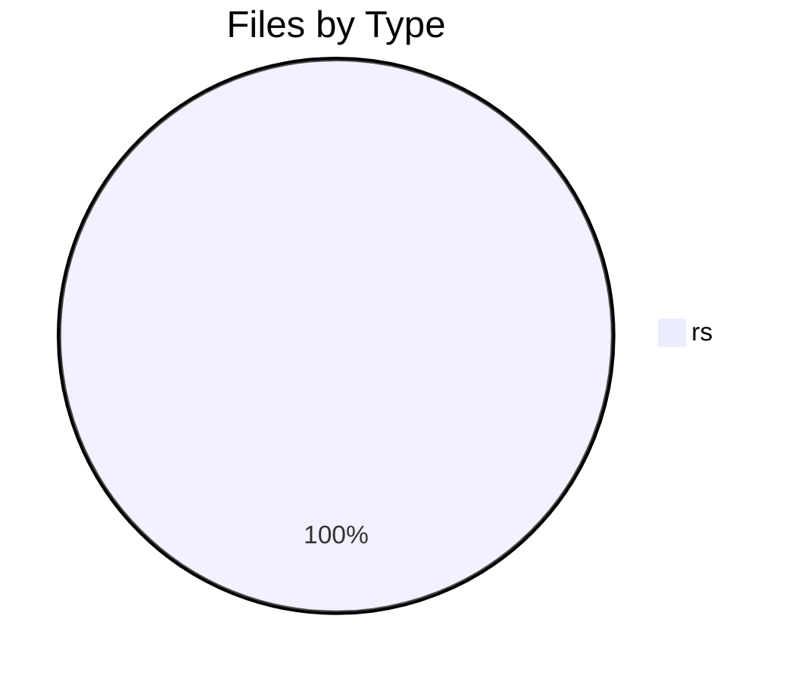
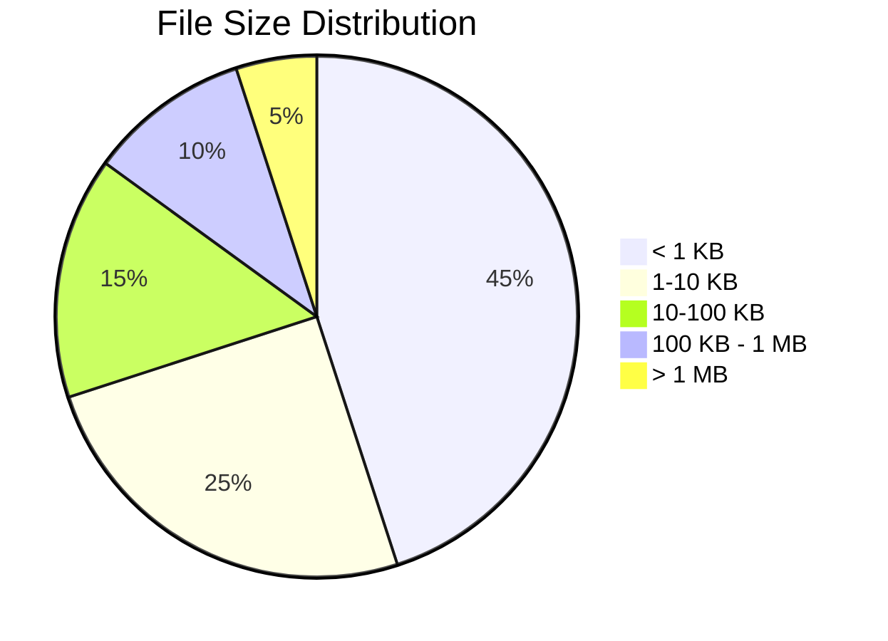

# 📊 Directory Analysis Report

**Generated by Smart Tree** | 2025-07-04 01:32:17

## 📁 Overview

- **Directory**: `src`
- **Total Files**: 41
- **Total Directories**: 4
- **Total Size**: 461.4 KB

## 🌳 Directory Structure

```mermaid
graph TD
    root["📁 src"]
    node_0[["📁 src"])
    root --> node_0
    node_1[["📁 formatters"])
    root --> node_1
    node_2["🦀 ai.rs<br/>7.1 KB"]
    node_1 --> node_2
    node_3["🦀 ai_json.rs<br/>5.2 KB"]
    node_1 --> node_3
    node_4["🦀 classic.rs<br/>13.3 KB"]
    node_1 --> node_4
    node_5["🦀 csv.rs<br/>1.9 KB"]
    node_1 --> node_5
    node_6["🦀 digest.rs<br/>2.3 KB"]
    node_1 --> node_6
    node_7["🦀 hex.rs<br/>6.9 KB"]
    node_1 --> node_7
    node_8["🦀 json.rs<br/>3.9 KB"]
    node_1 --> node_8
    node_9["🦀 markdown.rs<br/>16.0 KB"]
    node_1 --> node_9
    node_10["🦀 mermaid.rs<br/>14.7 KB"]
    node_1 --> node_10
    node_11["🦀 mod.rs<br/>1.3 KB"]
    node_1 --> node_11
    node_12["🦀 quantum.rs<br/>9.1 KB"]
    node_1 --> node_12
    node_13["🦀 quantum_safe.rs<br/>4.7 KB"]
    node_1 --> node_13
    node_14["🦀 quantum_semantic.rs<br/>3.8 KB"]
    node_1 --> node_14
    node_15["🦀 quantum_semantic_v2.rs<br/>3.1 KB"]
    node_1 --> node_15
    node_16["🦀 relations.rs<br/>12.3 KB"]
    node_1 --> node_16
    node_17["🦀 relations_formatter.rs<br/>5.3 KB"]
    node_1 --> node_17
    node_18["🦀 semantic.rs<br/>9.1 KB"]
    node_1 --> node_18
    node_19["🦀 stats.rs<br/>3.4 KB"]
    node_1 --> node_19
    node_20["🦀 summary.rs<br/>26.1 KB"]
    node_1 --> node_20
    node_21["🦀 summary_ai.rs<br/>11.0 KB"]
    node_1 --> node_21
    node_22["🦀 tsv.rs<br/>1.6 KB"]
    node_1 --> node_22
    node_23["🦀 context.rs<br/>4.8 KB"]
    root --> node_23
    node_24[["📁 mcp"])
    root --> node_24
    node_25["🦀 resources.rs<br/>4.4 KB"]
    node_24 --> node_25
    node_26["🦀 cache.rs<br/>2.4 KB"]
    node_24 --> node_26
    node_27["🦀 mod.rs<br/>10.0 KB"]
    node_24 --> node_27
    node_28["🦀 prompts.rs<br/>7.3 KB"]
    node_24 --> node_28
    node_29["🦀 tools.rs<br/>53.3 KB"]
    node_24 --> node_29
    node_30[["📁 decoders"])
    root --> node_30
    node_31["🦀 classic.rs<br/>865 B"]
    node_30 --> node_31
    node_32["🦀 hex.rs<br/>877 B"]
    node_30 --> node_32
    node_33["🦀 json.rs<br/>2.7 KB"]
    node_30 --> node_33
    node_34["🦀 mod.rs<br/>5.9 KB"]
    node_30 --> node_34
    node_35["🦀 content_detector.rs<br/>12.3 KB"]
    root --> node_35
    node_36["🦀 dynamic_tokenizer.rs<br/>11.2 KB"]
    root --> node_36
    node_37["🦀 quantum_scanner.rs<br/>10.8 KB"]
    root --> node_37
    node_38["🦀 scanner.rs<br/>78.9 KB"]
    root --> node_38
    node_39["🦀 semantic.rs<br/>16.3 KB"]
    root --> node_39
    node_40["🦀 tokenizer.rs<br/>13.6 KB"]
    root --> node_40
    node_41["🦀 tree_sitter_quantum.rs<br/>9.5 KB"]
    root --> node_41
    node_42["🦀 lib.rs<br/>1.8 KB"]
    root --> node_42
    node_43["🦀 main.rs<br/>34.2 KB"]
    root --> node_43
    node_44["🦀 relations.rs<br/>18.3 KB"]
    root --> node_44
```

## 📋 File Types Breakdown

| Extension | Count | Percentage | Total Size |
|-----------|-------|------------|------------|
| 🦀 .rs | 41 | 100.0% | - |

## 🍰 File Type Distribution



## 📊 Size Distribution



## 🏆 Largest Files

| Rank | File | Size |
|------|------|------|
| 🥇 | 🦀 scanner.rs | 78.9 KB |
| 🥈 | 🦀 tools.rs | 53.3 KB |
| 🥉 | 🦀 main.rs | 34.2 KB |
| 📄 | 🦀 summary.rs | 26.1 KB |
| 📄 | 🦀 relations.rs | 18.3 KB |
| 📄 | 🦀 semantic.rs | 16.3 KB |
| 📄 | 🦀 markdown.rs | 16.0 KB |
| 📄 | 🦀 mermaid.rs | 14.7 KB |
| 📄 | 🦀 tokenizer.rs | 13.6 KB |
| 📄 | 🦀 classic.rs | 13.3 KB |

## 🕐 Recent Activity

| File | Last Modified |
|------|---------------|
| 🦀 lib.rs | Today |
| 🦀 main.rs | Today |
| 🦀 relations.rs | Today |
| 🦀 semantic.rs | Today |
| 🦀 tokenizer.rs | Today |
| 🦀 tree_sitter_quantum.rs | Today |
| 🦀 scanner.rs | Today |
| 🦀 tools.rs | Today |
| 🦀 quantum_scanner.rs | Today |
| 🦀 cache.rs | Today |

## 📈 Summary

This analysis brought to you by **Smart Tree** 🌳
Where directories become beautiful documentation! ✨

---

*Generated with [Smart Tree](https://github.com/8b-is/smart-tree) - Making directory visualization intelligent, fast, and beautiful!*
