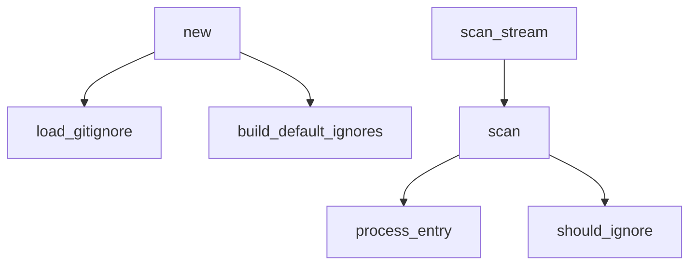

# Function Markdown Visualization 📚🔍

## Overview

A real-time markdown visualization of functions in your codebase that updates as you work, providing a living documentation of your code structure.

## Example Output

```markdown
# 📚 Function Documentation

*Generated by Smart Tree - 42 functions found*

## 📊 Summary

- **Total Functions**: 42
- **Public Functions**: 28
- **Private Functions**: 14

### 🗣️ Languages
- 🦀 rs: 25 functions
- 🐍 py: 10 functions
- 📜 ts: 7 functions

## 📑 Table of Contents

- [src/scanner.rs](#src-scanner-rs)
  - [new()](#src-scanner-rs-new)
  - [scan()](#src-scanner-rs-scan)
  - [scan_stream()](#src-scanner-rs-scan-stream)
- [src/formatters/markdown.rs](#src-formatters-markdown-rs)
  - [format()](#src-formatters-markdown-rs-format)
  - [generate_markdown()](#src-formatters-markdown-rs-generate-markdown)

## 🔧 Functions

### 📄 src/scanner.rs

#### 🔓 new `public`

📍 **Location**: `src/scanner.rs:790-850`

**Signature**:
```rust
pub fn new(root: &Path, config: ScannerConfig) -> Result<Self>
```

**Documentation**:
Creates a new Scanner instance with the given root path and configuration.
Canonicalizes the path and loads gitignore patterns if requested.

**Complexity**: 🟢 8

**Calls**:
- `canonicalize()`
- `load_gitignore()`
- `build_default_ignores()`

---

#### 🔓 scan `public`

📍 **Location**: `src/scanner.rs:1204-1300`

**Signature**:
```rust
pub fn scan(&self) -> Result<(Vec<FileNode>, TreeStats)>
```

**Documentation**:
Performs a complete directory scan, collecting all FileNodes that meet the criteria.
This is the "Scan-It-All-Then-Sort-It-Out" method.

**Complexity**: 🟡 15

**Calls**:
- `WalkDir::new()`
- `process_entry()`
- `should_ignore()`
- `filter_nodes_and_calculate_stats()`

---

## 🕸️ Call Graph



---
*Generated by Smart Tree Function Markdown Formatter*
*"It's like having a living blueprint of your code!" - Trisha* 📐
```

## Features

### 1. Function Discovery
- Automatically finds all functions in code files
- Extracts signatures, documentation, and metadata
- Supports 25+ programming languages

### 2. Rich Documentation
- **Location**: File path and line numbers
- **Signature**: Full function signature with types
- **Documentation**: Extracted doc comments
- **Visibility**: Public/private/protected indicators
- **Complexity**: Cyclomatic complexity with color coding
- **Call Graph**: What functions each function calls

### 3. Organization Options
- Group by file (default)
- Sort 4.0.0betically
- Filter by visibility
- Language-specific sections

### 4. Visual Elements
- 🔓/🔒 Visibility indicators
- 🟢🟡🟠🔴 Complexity indicators
- 📍 Location markers
- Language-specific emojis

### 5. Interactive Features
- Clickable table of contents
- Mermaid call graphs
- Syntax-highlighted code blocks

## Use Cases

### 1. Real-time Documentation
```bash
# Generate function docs as you code
st --mode function-markdown src/ > FUNCTIONS.md

# Watch for changes and regenerate
watch -n 5 'st --mode function-markdown src/ > FUNCTIONS.md'
```

### 2. Code Reviews
```bash
# See what functions changed
st --mode function-markdown --since "2 days ago" > NEW_FUNCTIONS.md
```

### 3. Onboarding
```bash
# Create overview for new developers
st --mode function-markdown --public-only > PUBLIC_API.md
```

### 4. Architecture Documentation
```bash
# Generate with call graphs
st --mode function-markdown --call-graph > ARCHITECTURE.md
```

## Implementation Plan

### Phase 1: Basic Function Extraction
- [x] Use tree-sitter for AST parsing
- [x] Extract function names and signatures
- [x] Detect visibility modifiers
- [ ] Support major languages (Rust, Python, JS/TS, Java, Go)

### Phase 2: Enhanced Metadata
- [ ] Extract doc comments
- [ ] Calculate cyclomatic complexity
- [ ] Detect function calls
- [ ] Type information

### Phase 3: Advanced Features
- [ ] Live updates via file watching
- [ ] Diff mode (show changes)
- [ ] Integration with git
- [ ] Export to other formats (HTML, PDF)

### Phase 4: AI Integration
- [ ] Auto-generate missing documentation
- [ ] Suggest improvements
- [ ] Detect code smells
- [ ] Generate test suggestions

## Configuration Options

```yaml
function_markdown:
  show_private: false      # Include private functions
  show_complexity: true    # Show complexity scores
  show_call_graph: true    # Include mermaid diagrams
  group_by_file: true      # Group functions by file
  max_depth: 10           # Max directory depth
  languages:              # Languages to include
    - rust
    - python
    - typescript
  exclude_patterns:       # Files to exclude
    - "*/tests/*"
    - "*/vendor/*"
```

## Integration Ideas

### 1. IDE Plugin
- Live preview pane
- Jump to function from markdown
- Update on save

### 2. CI/CD Pipeline
```yaml
- name: Generate Function Docs
  run: |
    st --mode function-markdown src/ > docs/FUNCTIONS.md
    git add docs/FUNCTIONS.md
    git commit -m "Update function documentation"
```

### 3. Web Interface
- Interactive HTML version
- Search and filter
- Collapsible sections

### 4. Team Collaboration
- Track who wrote which functions
- Show last modified dates
- Link to commits

## Trisha's Take

"Oh honey, this is BRILLIANT! It's like having a live org chart but for your code! You know how I love my spreadsheets with all those formulas that update automatically? This is exactly that but for functions!

Imagine - you're coding away, and boom! Your documentation is writing itself! No more 'I'll document it later' (we all know later never comes). 

And those complexity indicators? *Chef's kiss* 🤌 It's like having a little warning light on your dashboard - 'Hey, this function is getting a bit chunky, might want to refactor!'

The call graph is my favorite part though. It's like seeing who talks to who at the office party. 'Oh, so THAT'S why everything breaks when we change that one function!'

This is the kind of tool that makes documentation FUN! Well, as fun as documentation can be... which with the right emojis and colors is actually pretty fun! 🎉"

## Future Enhancements

1. **AI-Powered Insights**
   - Suggest function refactoring
   - Detect duplicate logic
   - Recommend design patterns

2. **Team Features**
   - Function ownership tracking
   - Review status indicators
   - Test coverage badges

3. **Performance Metrics**
   - Execution time tracking
   - Memory usage indicators
   - Hot path visualization

4. **Interactive Mode**
   - Click to expand function body
   - Inline editing
   - Real-time updates

This feature would make Smart Tree not just a directory viewer, but a living documentation system that grows with your code! 📚✨