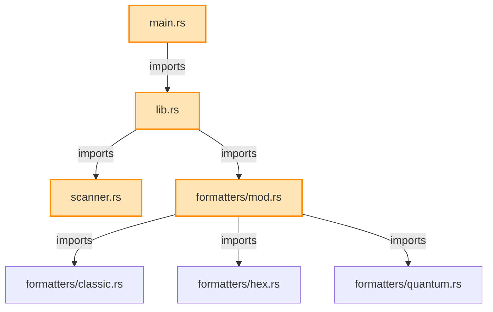

# Smart Tree Relations Example

This example shows how the relations feature visualizes code dependencies:

## Command
```bash
st --relations --mode mermaid src/
```

## Output


## Benefits

1. **Visual Understanding**: See how modules connect at a glance
2. **Impact Analysis**: Know what files are affected by changes
3. **Refactoring Guide**: Identify tightly coupled modules
4. **Documentation**: Auto-generated architecture diagrams

## Other Formats

### Text Summary
```bash
st --relations src/
```

### Compressed for AI
```bash
st --relations --mode digest src/
```

### Filter by Type
```bash
st --relations --filter imports src/
st --relations --filter tests src/
st --relations --filter coupled src/
```

### Focus on File
```bash
st --relations --focus src/main.rs
```