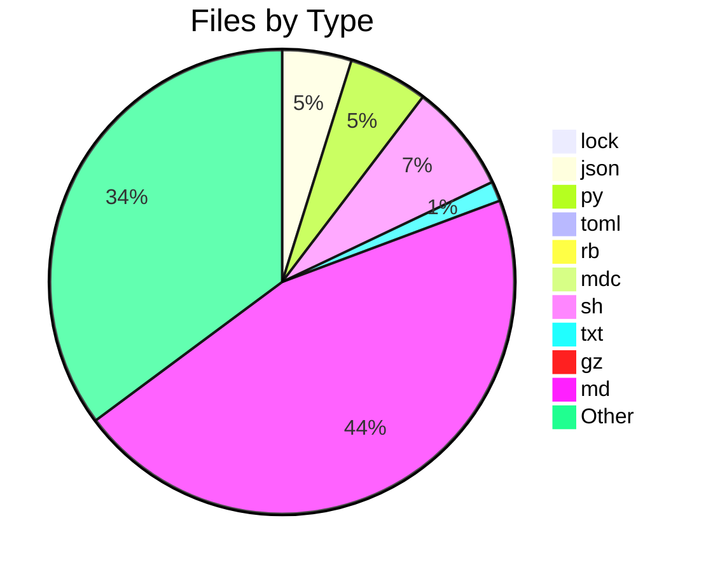
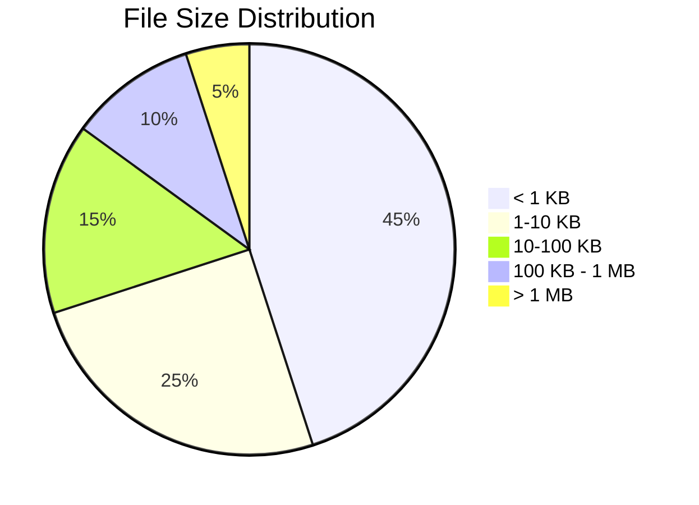

# 📊 Directory Analysis Report

**Generated by Smart Tree** | 2025-07-04 04:21:48

## 📁 Overview

- **Directory**: `smart-tree`
- **Total Files**: 151
- **Total Directories**: 17
- **Total Size**: 12.9 MB

## 🌳 Directory Structure

```mermaid
flowchart LR
    %% Smart Tree Directory Visualization
    root{"📁 smart-tree"}
    style root fill:#ff9800,stroke:#e65100,stroke-width:4px,color:#fff

    subgraph sub1 ["formatters" ]
        direction TB
        node_3["🦀ai.rs\n7.1 KB"]
        node_4["🦀ai_json.rs\n5.2 KB"]
        node_5["🦀classic.rs\n13.3 KB"]
        node_6["🦀csv.rs\n1.9 KB"]
        node_7["🦀digest.rs\n2.3 KB"]
        node_8["🦀hex.rs\n6.9 KB"]
        node_9["🦀json.rs\n3.9 KB"]
        node_10["🦀markdown.rs\n22.8 KB"]
        node_11["🦀mermaid.rs\n18.1 KB"]
        node_12["🦀mod.rs\n1.3 KB"]
        node_13["🦀quantum.rs\n9.1 KB"]
        node_14["🦀quantum_safe.rs\n4.7 KB"]
        node_15["🦀quantum_semantic.rs\n3.8 KB"]
        node_16["🦀quantum_semantic_v2.rs\n3.1 KB"]
        node_17["🦀relations.rs\n12.3 KB"]
        node_18["🦀relations_formatter.rs\n5.3 KB"]
        node_19["🦀semantic.rs\n9.1 KB"]
        node_20["🦀stats.rs\n3.4 KB"]
        node_21["🦀summary.rs\n26.1 KB"]
        node_22["🦀summary_ai.rs\n11.0 KB"]
        node_23["🦀tsv.rs\n1.6 KB"]
    end

    subgraph sub2 ["src" ]
        direction TB
        node_2["📁 formatters"]
        node_24["🦀context.rs\n4.8 KB"]
        node_25["📁 mcp"]
        node_31["📁 decoders"]
        node_36["🦀content_detector.rs\n12.3 KB"]
        node_37["🦀dynamic_tokenizer.rs\n11.2 KB"]
        node_38["🦀quantum_scanner.rs\n10.8 KB"]
        node_39["🦀scanner.rs\n78.9 KB"]
    end

    subgraph sub3 ["mcp" ]
        direction TB
        node_26["🦀resources.rs\n4.4 KB"]
        node_27["🦀cache.rs\n2.4 KB"]
        node_28["🦀mod.rs\n10.0 KB"]
        node_29["🦀prompts.rs\n7.3 KB"]
        node_30["🦀tools.rs\n59.4 KB"]
    end

    subgraph sub4 ["decoders" ]
        direction TB
        node_32["🦀classic.rs\n865 B"]
        node_33["🦀hex.rs\n877 B"]
        node_34["🦀json.rs\n2.7 KB"]
        node_35["🦀mod.rs\n5.9 KB"]
    end

    node_1["📁 src"]
    style node_1 fill:#e3f2fd,stroke:#1976d2,stroke-width:2px

    %% Connections
    root --> node_1
    root --> sub2
    node_1 --> sub1
    node_1 --> sub3
    node_1 --> sub4

    more["... and 128 more items"]
    style more fill:#ffecb3,stroke:#ff6f00,stroke-dasharray: 5 5
```



### 📂 Simple Tree View

```
📁 smart-tree/
├── 📁 src/
│   ├── 🦀 content_detector.rs (12.3 KB)
│   ├── 🦀 context.rs (4.8 KB)
│   ├── 📁 decoders/
│   ├── 🦀 dynamic_tokenizer.rs (11.2 KB)
│   ├── 📁 formatters/
│   ├── 📁 mcp/
│   ├── 🦀 quantum_scanner.rs (10.8 KB)
│   └── 🦀 scanner.rs (78.9 KB)
│   └── ... and 128 more items
```

## 📋 File Types Breakdown

| Extension | Count | Percentage | Total Size |
|-----------|-------|------------|------------|
| 📄 .lock | 1 | 0.7% | - |
| ⚙️ .json | 7 | 4.6% | - |
| 🐍 .py | 8 | 5.3% | - |
| ⚙️ .toml | 1 | 0.7% | - |
| 📄 .rb | 1 | 0.7% | - |
| 📄 .mdc | 1 | 0.7% | - |
| 📄 .sh | 11 | 7.3% | - |
| 📄 .txt | 2 | 1.3% | - |
| 📄 .gz | 1 | 0.7% | - |
| 📝 .md | 66 | 43.7% | - |
| 📜 .js | 2 | 1.3% | - |
| 📄 .png | 4 | 2.6% | - |
| ⚙️ .yml | 2 | 1.3% | - |
| 🦀 .rs | 43 | 28.5% | - |

## 🍰 File Type Distribution



## 📊 Size Distribution



## 🏆 Largest Files

| Rank | File | Size |
|------|------|------|
| 🥇 | 📄 st | 4.6 MB |
| 🥈 | 🖼️ ST-AYE.png | 2.7 MB |
| 🥉 | 📦 st-x86_64-unknown-linux-gnu.tar.gz | 1.9 MB |
| 📄 | 🖼️ ST-HUE.png | 1.7 MB |
| 📄 | 🖼️ icon.png | 449.8 KB |
| 📄 | 🖼️ icon.png | 449.8 KB |
| 📄 | 🦀 scanner.rs | 78.9 KB |
| 📄 | 🦀 tools.rs | 59.4 KB |
| 📄 | 📄 Cargo.lock | 47.9 KB |
| 📄 | 🦀 main.rs | 34.3 KB |

## 🕐 Recent Activity

| File | Last Modified |
|------|---------------|
| 📝 g.md | Today |
| 📝 treemap_scripts.md | Today |
| 📝 treemap_test.md | Today |
| 🦀 mermaid.rs | Today |
| 🦀 main.rs | Today |
| 🦀 markdown.rs | Today |
| 📝 improved_markdown.md | Today |
| 📝 test_markdown.md | Today |
| 📝 RELEASE_NOTES_v3.1.1.md | Today |
| 📄 install.sh | Today |

## 📈 Summary

This analysis brought to you by **Smart Tree** 🌳
Where directories become beautiful documentation! ✨

---

*Generated with [Smart Tree](https://github.com/8b-is/smart-tree) - Making directory visualization intelligent, fast, and beautiful!*
