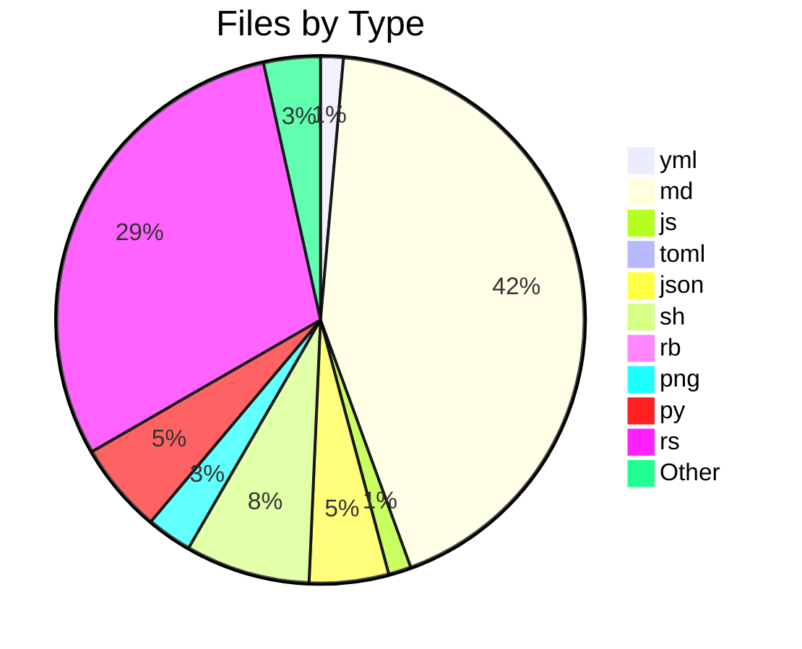
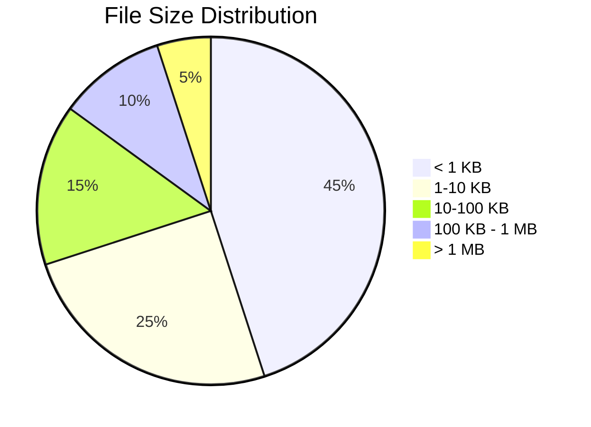

# 📊 Directory Analysis Report

**Generated by Smart Tree** | 2025-07-04 03:28:42

## 📁 Overview

- **Directory**: `smart-tree`
- **Total Files**: 147
- **Total Directories**: 17
- **Total Size**: 12.9 MB

## 🌳 Directory Structure

```mermaid
graph TD
    root["smart-tree"]
    node_1[["src"])
    root --> node_1
    node_2[["📁 formatters"])
    node_1 --> node_2
    node_3["ai.rs<br/>7.1 KB"]
    node_2 --> node_3
    node_4["ai_json.rs<br/>5.2 KB"]
    node_2 --> node_4
    node_5["classic.rs<br/>13.3 KB"]
    node_2 --> node_5
    node_6["csv.rs<br/>1.9 KB"]
    node_2 --> node_6
    node_7["digest.rs<br/>2.3 KB"]
    node_2 --> node_7
    node_8["hex.rs<br/>6.9 KB"]
    node_2 --> node_8
    node_9["json.rs<br/>3.9 KB"]
    node_2 --> node_9
    node_10["markdown.rs<br/>16.1 KB"]
    node_2 --> node_10
    node_11["mermaid.rs<br/>14.8 KB"]
    node_2 --> node_11
    node_12["mod.rs<br/>1.3 KB"]
    node_2 --> node_12
    node_13["quantum.rs<br/>9.1 KB"]
    node_2 --> node_13
    node_14["quantum_safe.rs<br/>4.7 KB"]
    node_2 --> node_14
    node_15["quantum_semantic.rs<br/>3.8 KB"]
    node_2 --> node_15
    node_16["quantum_semantic_v2.rs<br/>3.1 KB"]
    node_2 --> node_16
    node_17["relations.rs<br/>12.3 KB"]
    node_2 --> node_17
    node_18["relations_formatter.rs<br/>5.3 KB"]
    node_2 --> node_18
    node_19["semantic.rs<br/>9.1 KB"]
    node_2 --> node_19
    node_20["stats.rs<br/>3.4 KB"]
    node_2 --> node_20
    node_21["summary.rs<br/>26.1 KB"]
    node_2 --> node_21
    node_22["summary_ai.rs<br/>11.0 KB"]
    node_2 --> node_22
    node_23["tsv.rs<br/>1.6 KB"]
    node_2 --> node_23
    node_24["context.rs<br/>4.8 KB"]
    node_1 --> node_24
    node_25[["📁 mcp"])
    node_1 --> node_25
    node_26["resources.rs<br/>4.4 KB"]
    node_25 --> node_26
    node_27["cache.rs<br/>2.4 KB"]
    node_25 --> node_27
    node_28["mod.rs<br/>10.0 KB"]
    node_25 --> node_28
    node_29["prompts.rs<br/>7.3 KB"]
    node_25 --> node_29
    node_30["tools.rs<br/>59.4 KB"]
    node_25 --> node_30
    node_31[["📁 decoders"])
    node_1 --> node_31
    node_32["classic.rs<br/>865 B"]
    node_31 --> node_32
    node_33["hex.rs<br/>877 B"]
    node_31 --> node_33
    node_34["json.rs<br/>2.7 KB"]
    node_31 --> node_34
    node_35["mod.rs<br/>5.9 KB"]
    node_31 --> node_35
    node_36["content_detector.rs<br/>12.3 KB"]
    node_1 --> node_36
    node_37["dynamic_tokenizer.rs<br/>11.2 KB"]
    node_1 --> node_37
    node_38["quantum_scanner.rs<br/>10.8 KB"]
    node_1 --> node_38
    node_39["scanner.rs<br/>78.9 KB"]
    node_1 --> node_39
    node_40["semantic.rs<br/>16.3 KB"]
    node_1 --> node_40
    node_41["tokenizer.rs<br/>13.6 KB"]
    node_1 --> node_41
    node_42["tree_sitter_quantum.rs<br/>9.5 KB"]
    node_1 --> node_42
    node_43["lib.rs<br/>1.8 KB"]
    node_1 --> node_43
    node_44["main.rs<br/>34.2 KB"]
    node_1 --> node_44
    node_45["relations.rs<br/>18.3 KB"]
    node_1 --> node_45
    node_46["⚙️ settings.local.json<br/>121 B"]
    root --> node_46
    node_47[["📁 scripts"])
    root --> node_47
    node_48["📄 send-to-claude.sh<br/>2.9 KB"]
    node_47 --> node_48
    node_49["📄 install.sh<br/>4.1 KB"]
    node_47 --> node_49
    more["... and 114 more items"]
```

## 📋 File Types Breakdown

| Extension | Count | Percentage | Total Size |
|-----------|-------|------------|------------|
| ⚙️ .yml | 2 | 1.4% | - |
| 📝 .md | 62 | 42.2% | - |
| 📜 .js | 2 | 1.4% | - |
| ⚙️ .toml | 1 | 0.7% | - |
| ⚙️ .json | 7 | 4.8% | - |
| 📄 .sh | 11 | 7.5% | - |
| 📄 .rb | 1 | 0.7% | - |
| 📄 .png | 4 | 2.7% | - |
| 🐍 .py | 8 | 5.4% | - |
| .rs | 43 | 29.3% | - |
| 📄 .txt | 2 | 1.4% | - |
| 📄 .mdc | 1 | 0.7% | - |
| 📄 .lock | 1 | 0.7% | - |
| 📄 .gz | 1 | 0.7% | - |

## 🍰 File Type Distribution



## 📊 Size Distribution



## 🏆 Largest Files

| Rank | File | Size |
|------|------|------|
| 🥇 | 📄 st | 4.6 MB |
| 🥈 | 🖼️ ST-AYE.png | 2.7 MB |
| 🥉 | 📦 st-x86_64-unknown-linux-gnu.tar.gz | 1.9 MB |
| 📄 | 🖼️ ST-HUE.png | 1.7 MB |
| 📄 | 🖼️ icon.png | 449.8 KB |
| 📄 | 🖼️ icon.png | 449.8 KB |
| 📄 | scanner.rs | 78.9 KB |
| 📄 | tools.rs | 59.4 KB |
| 📄 | 📄 Cargo.lock | 47.9 KB |
| 📄 | main.rs | 34.2 KB |

## 🕐 Recent Activity

| File | Last Modified |
|------|---------------|
| 📝 g.md | Today |
| 📦 st-x86_64-unknown-linux-gnu.tar.gz | Today |
| 📄 st | Today |
| 📝 README.md | Today |
| 📝 RELEASE_NOTES_v3.1.1.md | Today |
| 📝 MCP_AI_BEST_PRACTICES.md | Today |
| tools.rs | Today |
| 📝 FYI.md | Today |
| markdown.rs | Today |
| ⚙️ release.yml | Today |

## 📈 Summary

This analysis brought to you by **Smart Tree** 🌳
Where directories become beautiful documentation! ✨

---

*Generated with [Smart Tree](https://github.com/8b-is/smart-tree) - Making directory visualization intelligent, fast, and beautiful!*
