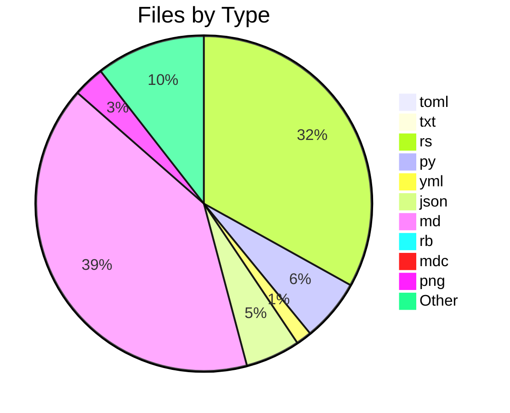
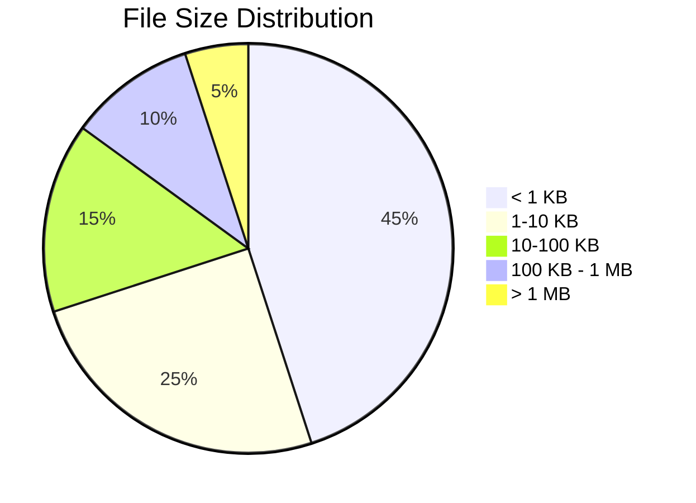

# 📊 Directory Analysis Report

**Generated by Smart Tree** | 2025-07-02 19:35:23

## 📁 Overview

- **Directory**: `smart-tree`
- **Total Files**: 138
- **Total Directories**: 16
- **Total Size**: 6.3 MB

## 🌳 Directory Structure

```mermaid
graph TD
    root["📁 smart-tree"]
    node_0[["📁 smart-tree"])
    root --> node_0
    node_1[["📁 src"])
    root --> node_1
    node_2[["📁 formatters"])
    node_1 --> node_2
    node_3["🦀 ai.rs<br/>7.1 KB"]
    node_2 --> node_3
    node_4["🦀 json.rs<br/>3.9 KB"]
    node_2 --> node_4
    node_5["🦀 stats.rs<br/>3.3 KB"]
    node_2 --> node_5
    node_6["🦀 csv.rs<br/>1.8 KB"]
    node_2 --> node_6
    node_7["🦀 tsv.rs<br/>1.6 KB"]
    node_2 --> node_7
    node_8["🦀 ai_json.rs<br/>5.2 KB"]
    node_2 --> node_8
    node_9["🦀 digest.rs<br/>2.2 KB"]
    node_2 --> node_9
    node_10["🦀 classic.rs<br/>13.2 KB"]
    node_2 --> node_10
    node_11["🦀 claude.rs<br/>6.9 KB"]
    node_2 --> node_11
    node_12["🦀 quantum_safe.rs<br/>4.6 KB"]
    node_2 --> node_12
    node_13["🦀 hex.rs<br/>6.9 KB"]
    node_2 --> node_13
    node_14["🦀 markdown.rs<br/>16.1 KB"]
    node_2 --> node_14
    node_15["🦀 mermaid.rs<br/>15.4 KB"]
    node_2 --> node_15
    node_16["🦀 quantum.rs<br/>9.2 KB"]
    node_2 --> node_16
    node_17["🦀 semantic.rs<br/>9.1 KB"]
    node_2 --> node_17
    node_18["🦀 mod.rs<br/>1.3 KB"]
    node_2 --> node_18
    node_19["🦀 relations.rs<br/>12.0 KB"]
    node_2 --> node_19
    node_20["🦀 relations_formatter.rs<br/>2.2 KB"]
    node_2 --> node_20
    node_21["🦀 quantum_semantic.rs<br/>3.8 KB"]
    node_2 --> node_21
    node_22["🦀 quantum_semantic_v2.rs<br/>3.1 KB"]
    node_2 --> node_22
    node_23["🦀 summary.rs<br/>24.9 KB"]
    node_2 --> node_23
    node_24["🦀 summary_ai.rs<br/>10.6 KB"]
    node_2 --> node_24
    node_25["🦀 context.rs<br/>4.8 KB"]
    node_1 --> node_25
    node_26[["📁 mcp"])
    node_1 --> node_26
    node_27["🦀 resources.rs<br/>4.4 KB"]
    node_26 --> node_27
    node_28["🦀 cache.rs<br/>2.4 KB"]
    node_26 --> node_28
    node_29["🦀 mod.rs<br/>9.9 KB"]
    node_26 --> node_29
    node_30["🦀 prompts.rs<br/>7.3 KB"]
    node_26 --> node_30
    node_31["🦀 tools.rs<br/>50.6 KB"]
    node_26 --> node_31
    node_32[["📁 decoders"])
    node_1 --> node_32
    node_33["🦀 hex.rs<br/>798 B"]
    node_32 --> node_33
    node_34["🦀 mod.rs<br/>6.0 KB"]
    node_32 --> node_34
    node_35["🦀 classic.rs<br/>782 B"]
    node_32 --> node_35
    node_36["🦀 json.rs<br/>2.7 KB"]
    node_32 --> node_36
    node_37["🦀 tokenizer.rs<br/>12.6 KB"]
    node_1 --> node_37
    node_38["🦀 quantum_scanner.rs<br/>11.0 KB"]
    node_1 --> node_38
    node_39["🦀 main.rs<br/>34.0 KB"]
    node_1 --> node_39
    node_40["🦀 scanner.rs<br/>79.2 KB"]
    node_1 --> node_40
    node_41["🦀 semantic.rs<br/>13.5 KB"]
    node_1 --> node_41
    node_42["🦀 lib.rs<br/>1.8 KB"]
    node_1 --> node_42
    node_43["🦀 relations.rs<br/>14.5 KB"]
    node_1 --> node_43
    node_44["🦀 content_detector.rs<br/>12.0 KB"]
    node_1 --> node_44
    node_45["🦀 tree_sitter_quantum.rs<br/>9.1 KB"]
    node_1 --> node_45
    node_46["🦀 dynamic_tokenizer.rs<br/>10.9 KB"]
    node_1 --> node_46
    node_47["⚙️ settings.local.json<br/>121 B"]
    root --> node_47
    node_48[["📁 scripts"])
    root --> node_48
    node_49["📄 manage.sh<br/>25.9 KB"]
    node_48 --> node_49
    more["... and 104 more items"]
```

## 📋 File Types Breakdown

| Extension | Count | Percentage | Total Size |
|-----------|-------|------------|------------|
| ⚙️ .toml | 1 | 0.7% | - |
| 📄 .txt | 1 | 0.7% | - |
| 🦀 .rs | 44 | 31.9% | - |
| 🐍 .py | 8 | 5.8% | - |
| ⚙️ .yml | 2 | 1.4% | - |
| ⚙️ .json | 7 | 5.1% | - |
| 📝 .md | 54 | 39.1% | - |
| 📄 .rb | 1 | 0.7% | - |
| 📄 .mdc | 1 | 0.7% | - |
| 📄 .png | 4 | 2.9% | - |
| 📜 .js | 2 | 1.4% | - |
| 📄 .sh | 11 | 8.0% | - |
| 📄 .lock | 1 | 0.7% | - |

## 🍰 File Type Distribution



## 📊 Size Distribution



## 🏆 Largest Files

| Rank | File | Size |
|------|------|------|
| 🥇 | 🖼️ ST-AYE.png | 2.7 MB |
| 🥈 | 🖼️ ST-HUE.png | 1.7 MB |
| 🥉 | 🖼️ icon.png | 449.8 KB |
| 📄 | 🖼️ icon.png | 449.8 KB |
| 📄 | 🦀 scanner.rs | 79.2 KB |
| 📄 | 🦀 tools.rs | 50.6 KB |
| 📄 | 📄 Cargo.lock | 47.9 KB |
| 📄 | 🦀 main.rs | 34.0 KB |
| 📄 | 📄 manage.sh | 25.9 KB |
| 📄 | 🦀 summary.rs | 24.9 KB |

## 🕐 Recent Activity

| File | Last Modified |
|------|---------------|
| 📄 glow | Today |
| 🦀 summary.rs | Today |
| 🦀 summary_ai.rs | Today |
| 🦀 content_detector.rs | Today |
| 🦀 quantum_semantic.rs | Today |
| 🦀 main.rs | Today |
| 🦀 mod.rs | Today |
| ⚙️ mcp.json | Today |
| 🦀 relations.rs | Today |
| 📝 Room-For-Improvements.md | Today |

## 📈 Summary

This analysis brought to you by **Smart Tree** 🌳
Where directories become beautiful documentation! ✨

---

*Generated with [Smart Tree](https://github.com/8b-is/smart-tree) - Making directory visualization intelligent, fast, and beautiful!*
