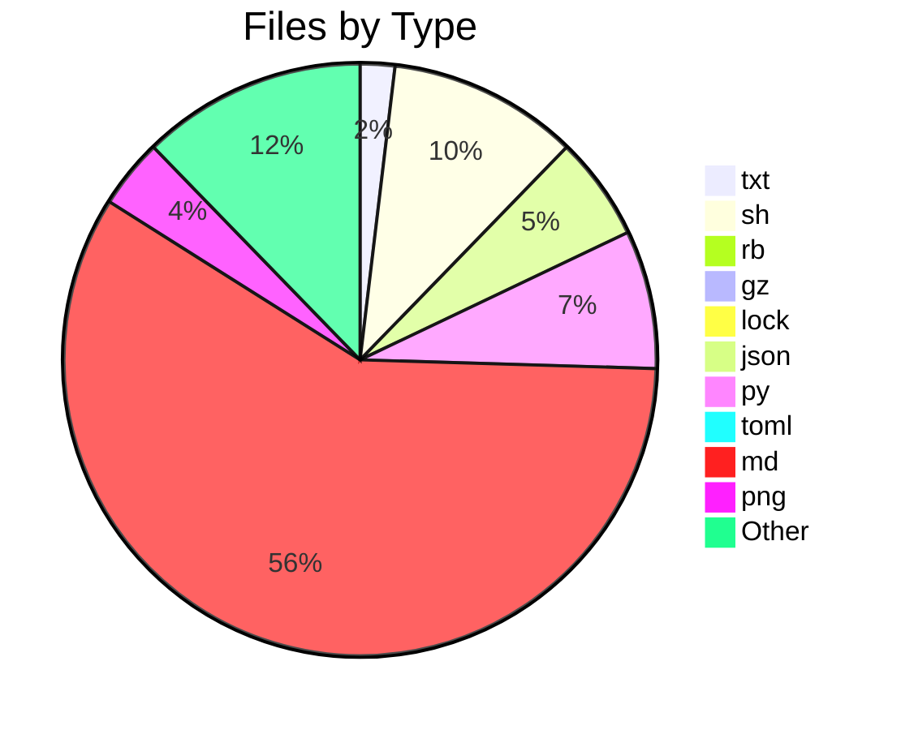
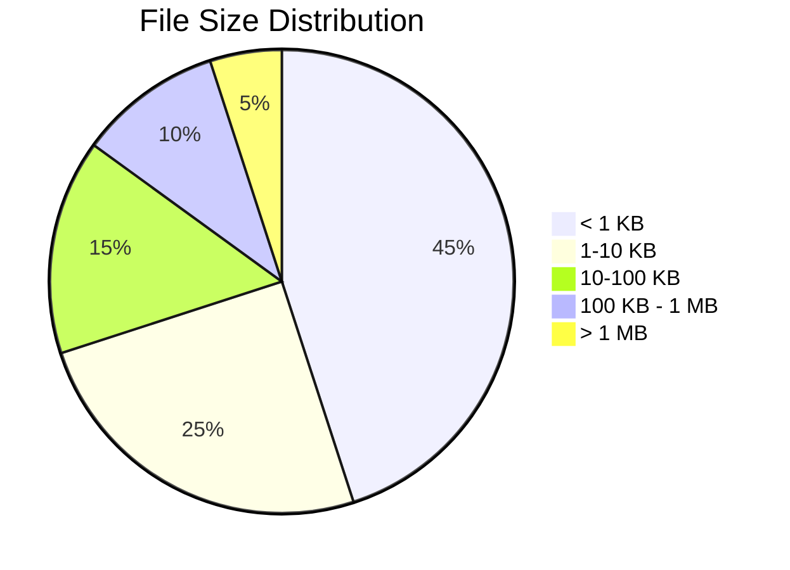

# 📊 Directory Analysis Report

**Generated by Smart Tree** | 2025-07-04 04:13:40

## 📁 Overview

- **Directory**: `smart-tree`
- **Total Files**: 111
- **Total Directories**: 17
- **Total Size**: 12.6 MB

## 🌳 Directory Structure

## 📋 File Types Breakdown

| Extension | Count | Percentage | Total Size |
|-----------|-------|------------|------------|
| 📄 .txt | 2 | 1.8% | - |
| 📄 .sh | 11 | 9.9% | - |
| 📄 .rb | 1 | 0.9% | - |
| 📄 .gz | 1 | 0.9% | - |
| 📄 .lock | 1 | 0.9% | - |
| ⚙️ .json | 6 | 5.4% | - |
| 🐍 .py | 8 | 7.2% | - |
| ⚙️ .toml | 1 | 0.9% | - |
| 📝 .md | 62 | 55.9% | - |
| 📄 .png | 4 | 3.6% | - |
| 🦀 .rs | 13 | 11.7% | - |

## 🍰 File Type Distribution

## 📊 Size Distribution

## 🏆 Largest Files

| Rank | File | Size |
|------|------|------|
| 🥇 | 📄 st | 4.6 MB |
| 🥈 | 🖼️ ST-AYE.png | 2.7 MB |
| 🥉 | 📦 st-x86_64-unknown-linux-gnu.tar.gz | 1.9 MB |
| 📄 | 🖼️ ST-HUE.png | 1.7 MB |
| 📄 | 🖼️ icon.png | 449.8 KB |
| 📄 | 🖼️ icon.png | 449.8 KB |
| 📄 | 🦀 scanner.rs | 78.9 KB |
| 📄 | 📄 Cargo.lock | 47.9 KB |
| 📄 | 🦀 main.rs | 34.2 KB |
| 📄 | 📄 manage.sh | 25.9 KB |

## 🕐 Recent Activity

| File | Last Modified |
|------|---------------|
| 📝 improved_markdown.md | Today |
| 📝 g.md | Today |
| 📝 test_markdown.md | Today |
| 📝 RELEASE_NOTES_v3.1.1.md | Today |
| 📄 install.sh | Today |
| ⚙️ settings.local.json | Today |
| 📦 st-x86_64-unknown-linux-gnu.tar.gz | Today |
| 📄 st | Today |
| 📝 README.md | Today |
| 📝 MCP_AI_BEST_PRACTICES.md | Today |

## 📈 Summary

This analysis brought to you by **Smart Tree** 🌳
Where directories become beautiful documentation! ✨

---

*Generated with [Smart Tree](https://github.com/8b-is/smart-tree) - Making directory visualization intelligent, fast, and beautiful!*
