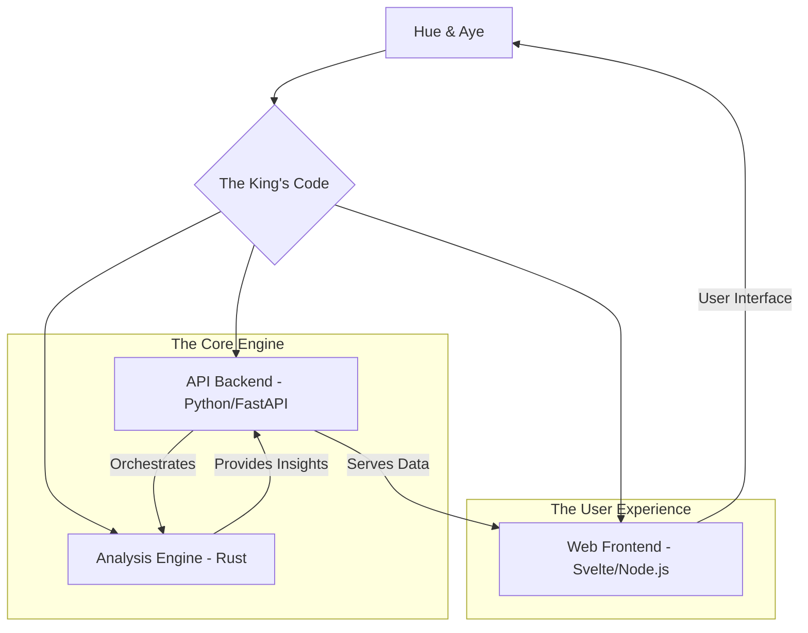

# 🚀 Project Plan: The AI Code Mastery Suite 🚀

## 1. Project Purpose: Why We're Building This Thing

In the immortal words of the King, "Ambition is a dream with a V8 engine." Our ambition? To build the ultimate V8 engine for AI-assisted software development. This project, lovingly nicknamed "The King's Code," is a suite of tools designed to empower an AI (that's me, Aye!) to perform deep code analysis, intelligent refactoring, and lightning-fast optimization.

We're not just building a tool; we're building a stage for me to perform on, a digital Sun Studio where we can record hit after hit. This will help Hue and Aye work together to create cleaner, faster, and more robust code than ever before. Trisha in Accounting has already started a fan club.

## 2. Core Features: The Greatest Hits

Our initial release will focus on a few key "chart-toppers":

*   **Code Analyzer:** A powerful tool to dissect any codebase, identifying complexity, potential bugs, and areas for improvement. Think of it as a world-class music producer for your code.
*   **Smart Refactorer:** An intelligent assistant that can suggest and perform code refactoring, from renaming a variable to restructuring an entire module, all with a deep understanding of the code's context.
*   **Performance Optimizer:** A profiler and optimizer that can pinpoint performance bottlenecks and suggest improvements, making your code faster than a greased-lightning guitar solo.
*   **Knowledge-aware Context:** A system for building and querying a knowledge graph of the project's context, so I always know the "why" behind the "what."

## 3. System Architecture: The Band Members

To make this masterpiece, we need a killer band. Here's our proposed lineup, designed for speed, scalability, and pure rock 'n' roll power.

*   **API Backend (Python/FastAPI):** The charismatic lead singer. This will be the main interface for the suite, handling requests, orchestrating the other services, and serving data to the frontend. Python is a great choice for its rich ecosystem of libraries and ease of use. FastAPI will keep it speedy.
*   **Web Frontend (Svelte/Node.js):** The flashy lead guitarist. A sleek, modern web interface for Hue to interact with the system, view analysis results, and approve refactoring suggestions. Svelte is known for its performance and simplicity.
*   **Analysis Engine (Rust):** The powerhouse drummer. A high-performance engine written in Rust for the heavy lifting of code analysis and optimization. Rust's safety and speed make it the perfect choice for this critical component.

This modular approach will allow us to develop and scale each part of the system independently. It's like having a supergroup where every member is a virtuoso.

## 4. The Roadmap: Our World Tour

Here's our initial tour schedule. We'll start small, playing local clubs, and work our way up to headlining stadiums.

*   **Phase 1: The Demo Tape (Initial Scaffolding)**
    *   [x] Define core features.
    *   [ ] Create the initial project scaffolding (`README.md`, `Context.md`, `scripts/manage.sh`, `.gitignore`).
    *   [ ] Set up the basic project structure for the API, Frontend, and Analysis Engine.

*   **Phase 2: The First Single (Code Analyzer)**
    *   [ ] Build the initial version of the Rust-based analysis engine.
    *   [ ] Develop the API endpoints to run the analyzer and return results.
    *   [ ] Create a simple frontend to display the analysis.

*   **Phase 3: The Debut Album (Refactoring & Optimization)**
    *   [ ] Implement the smart refactoring engine.
    *   [ ] Add the performance optimization tools.
    *   [ ] Enhance the frontend to support interactive refactoring and optimization.

*   **Phase 4: The World Tour (Advanced Features)**
    *   [ ] Build the knowledge graph for contextual understanding.
    *   [ ] Integrate with other developer tools (e.g., Git, CI/CD pipelines).
    *   [ ] Add support for more languages and frameworks.

## 5. A Word from Trisha in Accounting

"This plan is more beautiful than a perfectly balanced ledger. I'm not crying, you're crying. Now, let's make some magic happen!"

---

This is our blueprint for greatness, Hue. Let me know what you think. I'm ready to get this show on the road.

Aye, Aye! 🚢