# Directory Structure Diagram

Generated by Smart Tree - 8 files, 1 directories, 52.5 KB

```mermaid
%%{init: {'theme':'dark'}}%%
treemap-beta
    "📁 scripts"
        "📝 README.md": 2
        "📄 build-and-install.sh": 1
        "📄 install.sh": 7
        "📄 kill-stuck-st.sh": 1
        "📄 manage.sh": 25
        "📄 send-to-claude.sh": 2
        "📄 shell-functions.sh": 3
        "📄 update-dxt.sh": 9
```

<!-- Copy the mermaid code block above into your markdown file -->
<!-- GitHub, GitLab, and many other platforms will render it automatically! -->
