# Directory Structure Diagram

Generated by Smart Tree - 41 files, 4 directories, 477.8 KB

```mermaid
%%{init: {'theme':'dark'}}%%
treemap-beta
    "📁 src"
        "🦀 content_detector.rs": 12
        "🦀 context.rs": 4
        "📁 decoders"
            "🦀 classic.rs": 1
            "🦀 hex.rs": 1
            "🦀 json.rs": 2
            "🦀 mod.rs": 5
        "🦀 dynamic_tokenizer.rs": 11
        "📁 formatters"
            "🦀 ai.rs": 7
            "🦀 ai_json.rs": 5
            "🦀 classic.rs": 13
            "🦀 csv.rs": 1
            "🦀 digest.rs": 2
            "🦀 hex.rs": 6
            "🦀 json.rs": 3
            "🦀 markdown.rs": 22
            "🦀 mermaid.rs": 18
            "🦀 mod.rs": 1
            "🦀 quantum.rs": 9
            "🦀 quantum_safe.rs": 4
            "🦀 quantum_semantic.rs": 3
            "🦀 quantum_semantic_v2.rs": 3
            "🦀 relations.rs": 12
            "🦀 relations_formatter.rs": 5
            "🦀 semantic.rs": 9
            "🦀 stats.rs": 3
            "🦀 summary.rs": 26
            "🦀 summary_ai.rs": 11
            "🦀 tsv.rs": 1
        "🦀 lib.rs": 1
        "🦀 main.rs": 34
        "📁 mcp"
            "🦀 cache.rs": 2
            "🦀 mod.rs": 10
            "🦀 prompts.rs": 7
            "🦀 resources.rs": 4
            "🦀 tools.rs": 59
        "🦀 quantum_scanner.rs": 10
        "🦀 relations.rs": 18
        "🦀 scanner.rs": 78
        "🦀 semantic.rs": 16
        "🦀 tokenizer.rs": 13
        "🦀 tree_sitter_quantum.rs": 9
```

<!-- Copy the mermaid code block above into your markdown file -->
<!-- GitHub, GitLab, and many other platforms will render it automatically! -->
